# Setup EC2 Instsance

## Go to the EC2 Dashboard

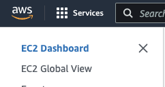

## Start the Launch Instance workflow

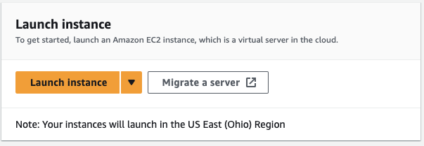

## Name the Instance

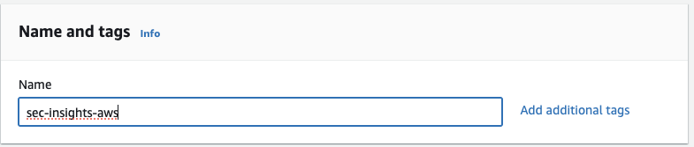

## Select Operating System - Ubuntu

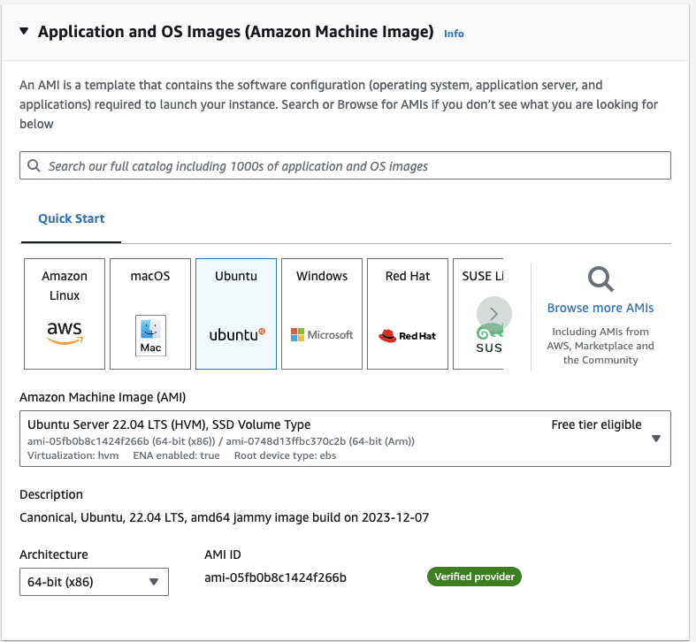

## Large Instance Size

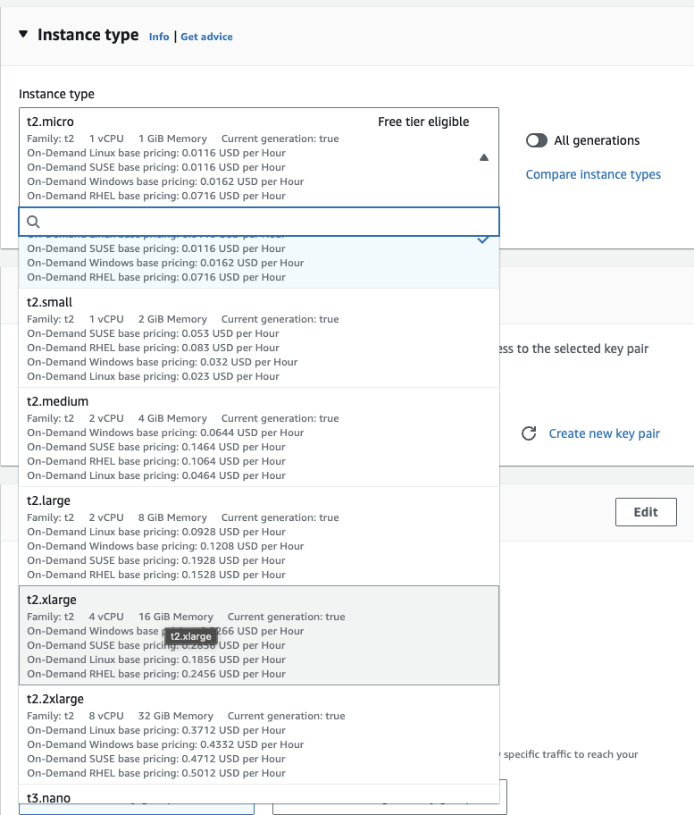

## Configure Your Key Pair

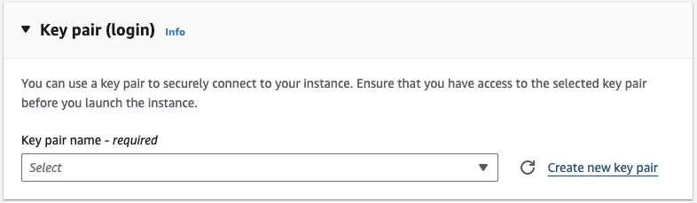

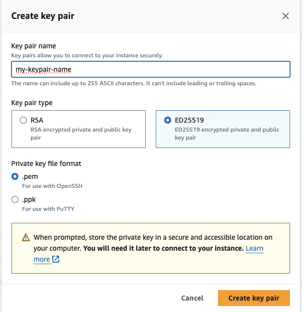

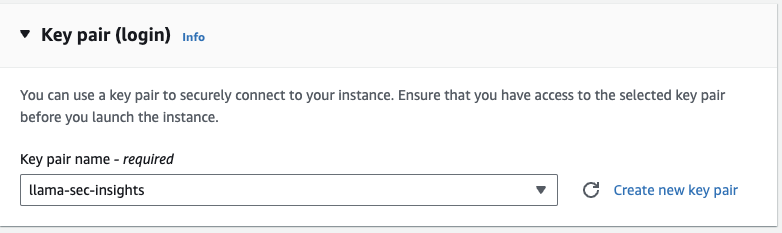

## Increase Default Storage

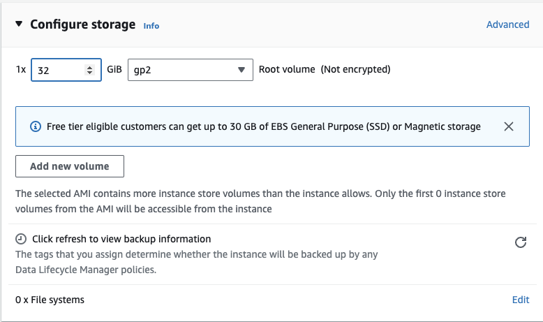

## Find New Instance

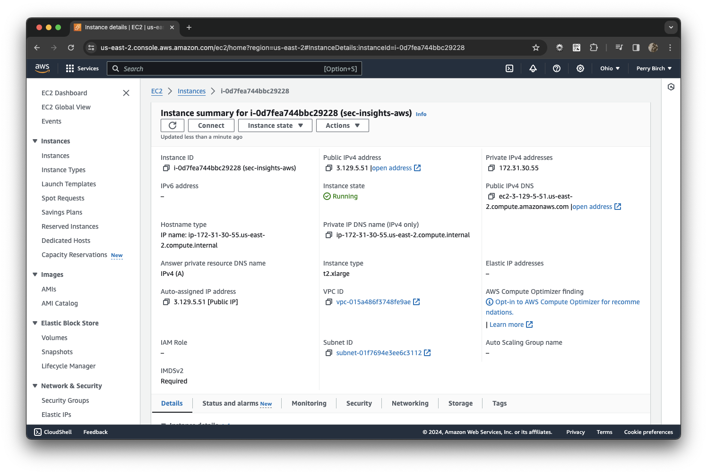

## Connect with EC2 Instance Connect

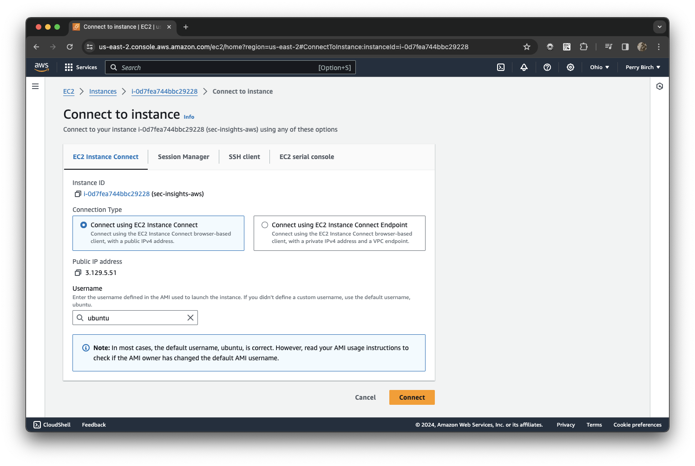

## Connect with Terminal

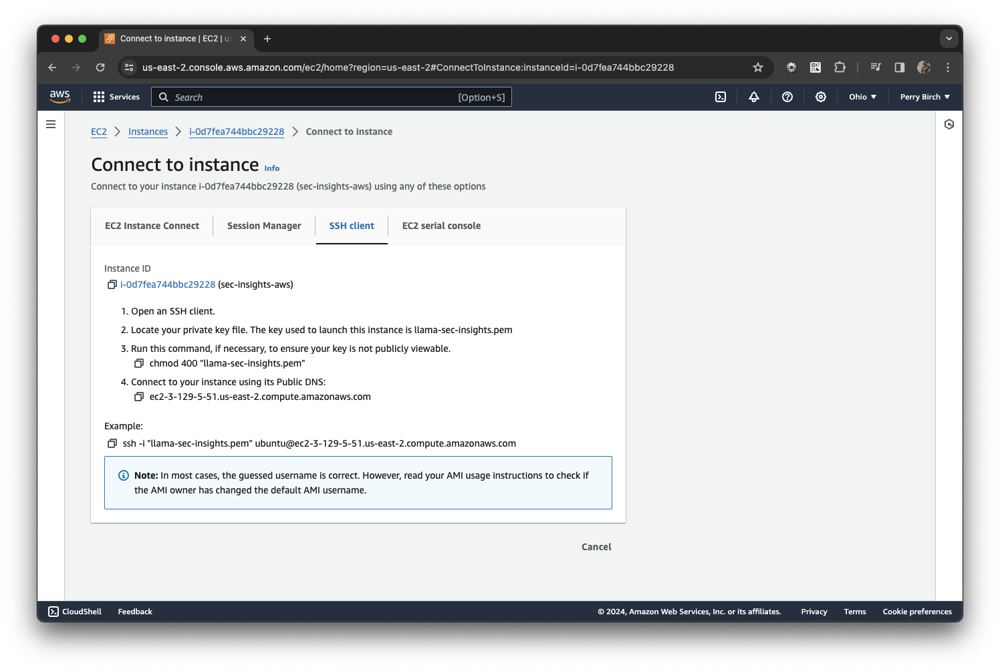

## Connect the Terminal

- [~/Desktop/sec-insights] is the folder where the .pem file was downloaded
- Note the instructions (using the name you selected for your pem file):
```sh
chmod 400 "llama-sec-insights.pem"
```

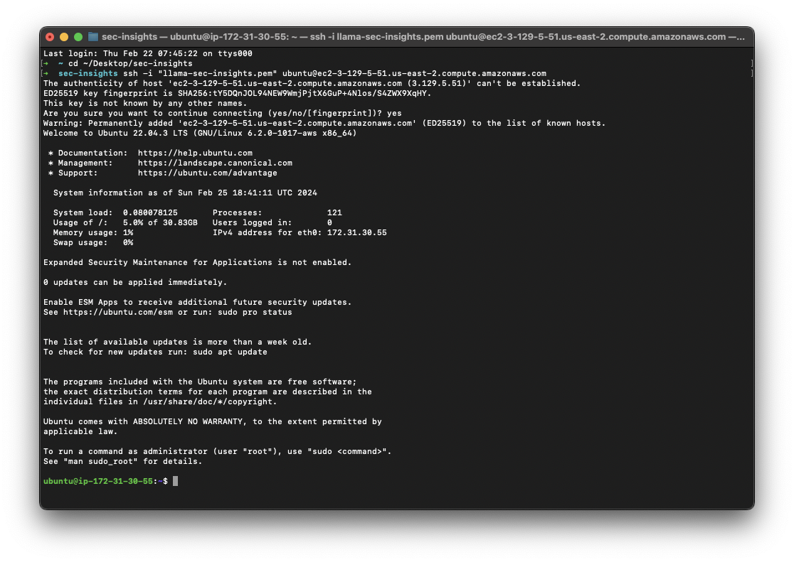

## Next Steps

[Configure Ubuntu](./ubuntu.md)